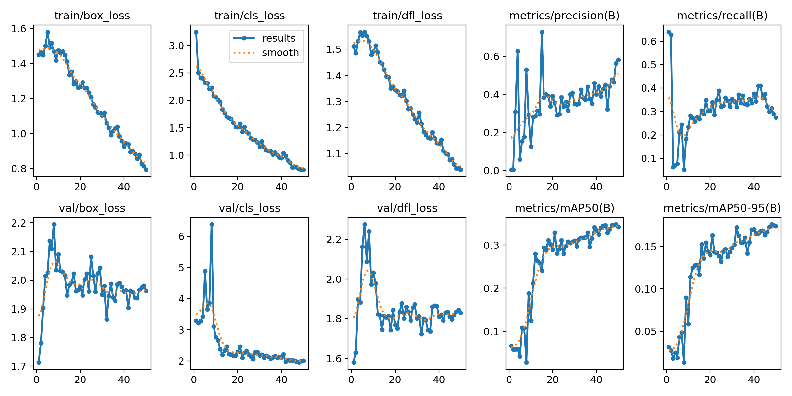
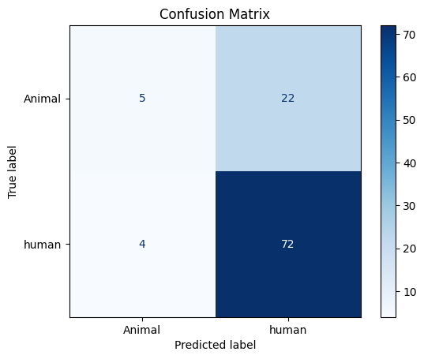

# Why YOLO for Object Detection

I chose YOLO (You Only Look Once) for object detection because it offers an excellent trade-off between speed and accuracy, making it ideal for real-time applications. YOLOv8, in particular, is lightweight, fast, and highly accurate. Its single-shot detection approach ensures rapid processing, and its widespread adoption in the computer vision community provides strong support and resources for integration and optimization.

#Accuracy of retrained of YOLO:

**Precision** of all class :0.80

## Why MobileNetV2 for Classification?

For the classification task, I used **MobileNetV2** as the base model with a custom dense layer on top. The key reasons for this choice are:

- **Efficient on Small Images**: MobileNetV2 is optimized for mobile and embedded vision applications, and it performs well on small-sized images — which aligns perfectly with the cropped outputs from YOLO object detection.
- **Lightweight and Fast**: Its depthwise separable convolutions reduce the number of parameters and computational cost, enabling real-time performance even on constrained devices.
- **Transfer Learning Ready**: MobileNetV2 is pre-trained on large datasets like ImageNet and has proven effective in transfer learning scenarios, allowing fast convergence on custom datasets.
- **Good Generalization**: It offers a good balance between accuracy and inference time, and with a simple dense layer on top, it adapts easily to new classification tasks.

## Why YOLO is Not Used for Classification

While YOLOv8 is excellent for **object detection**, it is not designed for **fine-grained image classification**. Here's why:

- **Detection vs Classification Purpose**: YOLO’s primary job is to detect object locations and assign class labels in a multi-object setting. It does not specialize in high-accuracy classification of single, cropped objects.
- **Low Resolution Crops**: The object crops obtained from YOLO are often small and require a model that performs well on such inputs. Classification with YOLO directly would not leverage transfer learning or specialized feature extractors like MobileNetV2.
- **No Dense Classification Layers**: YOLO does not have fully connected classification heads like CNN-based classifiers. Adding classification layers directly into YOLO would require re-architecting and retraining the entire model.

Therefore, the pipeline uses YOLOv8 to detect and crop objects, and then MobileNetV2 + Dense Layer to classify them with higher accuracy.

Accuracy of Classification model:

Validation Accuracy: 0.87

